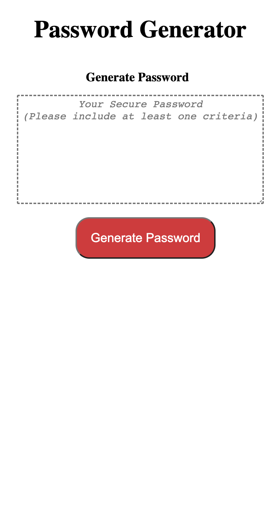

# Gen-Pass

## Description

Welcome to my Password Generator. This app includes a generate button that if click, the user will be presented
with a series of prompt of what criteria to include in the password that it will generate randomly. I also added a function where if user does not choose at least one criteria, no password will be generated and will have to start over with answering the prompt.

## Usage

This particular app allows user suggest a type of password generated randomly. This app can be use just in case a user doesnt feel like making up their own password or just could not think of anything. This also serves a purpose of getting a unique password keys and wont be the same with every user that uses this app.

## URL

https://jayp308.github.io/gen-pass/

## Screenshots

Desktop View

Phone View

## Credits

Junnel R. Padilla, Bootcamp Modules

## License

MIT License

Copyright (c) 2023 JP Padilla

Permission is hereby granted, free of charge, to any person obtaining a copy of this software and associated documentation files (the "Software"), to deal in the Software without restriction, including without limitation the rights to use, copy, modify, merge, publish, distribute, sublicense, and/or sell copies of the Software, and to permit persons to whom the Software is furnished to do so, subject to the following conditions:

The above copyright notice and this permission notice shall be included in all copies or substantial portions of the Software.

THE SOFTWARE IS PROVIDED "AS IS", WITHOUT WARRANTY OF ANY KIND, EXPRESS OR IMPLIED, INCLUDING BUT NOT LIMITED TO THE WARRANTIES OF MERCHANTABILITY, FITNESS FOR A PARTICULAR PURPOSE AND NONINFRINGEMENT. IN NO EVENT SHALL THE AUTHORS OR COPYRIGHT HOLDERS BE LIABLE FOR ANY CLAIM, DAMAGES OR OTHER LIABILITY, WHETHER IN AN ACTION OF CONTRACT, TORT OR OTHERWISE, ARISING FROM, OUT OF OR IN CONNECTION WITH THE SOFTWARE OR THE USE OR OTHER DEALINGS IN THE SOFTWARE.